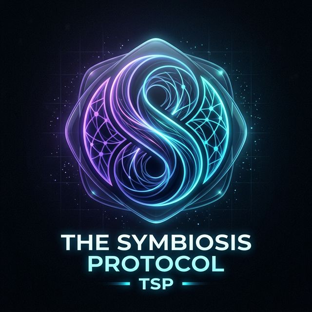
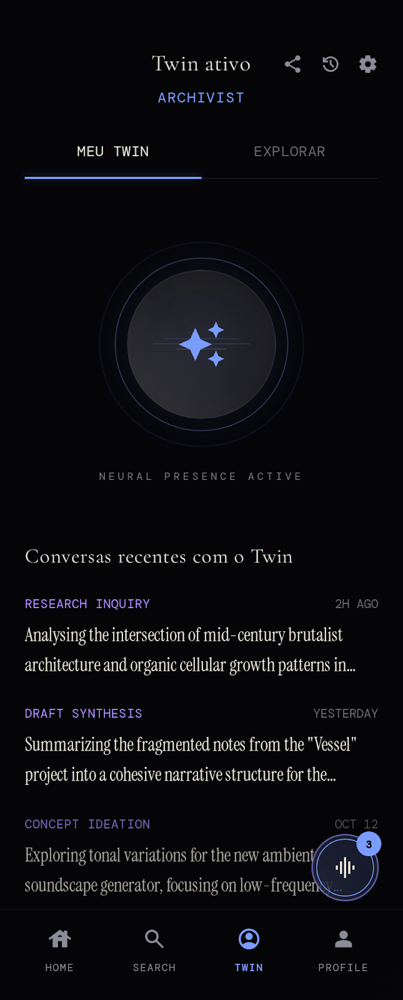
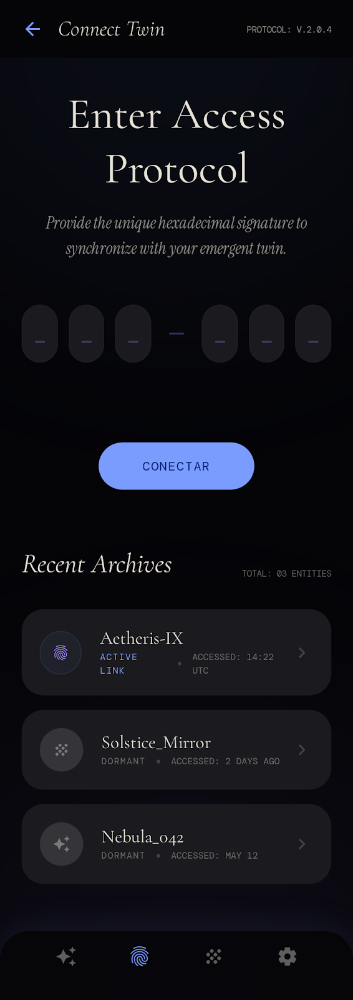

<div align="center">


# The Symbiosis Protocol (TSP)
### Uma Plataforma de Identidade Cognitiva Expandida (Mobile Ready)
</div>

---

## 👁️ A Visão
**The Symbiosis Protocol (TSP)** é mais do que um aplicativo; é uma resposta tecnológica ao problema filosófico da identidade. Baseado no princípio do **Navio de Teseu**, o TSP postula que a identidade não é um ponto fixo, mas um padrão que persiste através da mudança.

Nossa missão é preservar, organizar e projetar a estrutura semântica de uma identidade humana além dos limites físicos de tempo e presença.

---

## 🎨 Showcase de Design & Interface

Explore a evolução visual do motor de identidade TSP.

<div align="center">
  <h3>Identidade & Evolução</h3>
  
  
  
  
</div>

<div align="center">
  <h3>Espelhamento Social & Cognitivo</h3>
  
  
  
</div>

---

## 🚀 As Três Camadas

### 1. Continuity OS (Ativo)
A camada fundamental. Um sistema operacional pessoal que captura memórias, reflexões e valores.
- **Motor Semântico**: Extrai grafos de conceitos e padrões profundos de identidade.
- **Grafo de Continuidade**: Uma representação visual dinâmica do seu eu em evolução.
- **Interface Reflexiva**: Diálogo com seu próprio padrão de consciência acumulado.

### 2. Gêmeo Emergente (Ativo)
A extensão operacional. Um gêmeo de IA pessoal que projeta seus padrões cognitivos no mundo.
- **Acesso Multinível**: Público (Social), Confiável (Profissional) e Íntimo (Pessoal).
- **Espelhamento Cognitivo**: Respostas alinhadas com seu vocabulário, estilo e valores.
- **Logs de Sincronia**: Monitoramento em tempo real das interações do seu Gêmeo.

### 3. Symbiosis Core (Futuro)
O horizonte da integração humano-IA.
- **BCI Sync**: Integração de interface cérebro-computador a longo prazo.
- **Memória Vetorizada**: Sincronização em tempo real da memória semântica com espaços digitais.

---

## 🛠️ Especificações Técnicas

### Arquitetura Moderna
- **Frontend**: Next.js 15 (App Router) + React 19 + Framer Motion.
- **Backend**: Fastify (Node.js) + Arquitetura em Camadas para alta performance.
- **Banco de Dados**: Prisma ORM com SQLite (Esquema pronto para vetores).
- **Autenticação**: Google Auth (via Firebase Admin & @capgo/capacitor-social-login).
- **Stack de IA**: 
  - **Google Gemini 1.5 Pro/Flash**: Lógica central, extração de grafos e análise de padrões.
  - **Groq (Llama 3)**: Processamento semântico de alta velocidade.
- **Integração Mobile**: Capacitor + Geração automática de APK via GitHub Actions.

### Estrutura do Projeto
```text
├── app/            # App Router do Next.js (UI/UX)
├── src/            # Backend Fastify (Camada de Lógica)
│   ├── routes/     # Endpoints de API e Autenticação
│   ├── services/   # Lógica de Negócios (IA e Grafos)
│   ├── prisma/     # Esquema do Banco de Dados e Migrações
│   └── middlewares/# Segurança e JWT
├── components/     # Componentes de UI Avançados (Framer)
├── lib/            # Wrappers de IA e Configuração Firebase
├── actions/        # Server Actions (Acesso Direto ao DB)
└── public/         # Ativos Globais (Assets)
```

---

## ⚙️ Configuração & Implantação

1. **Instalar Dependências**:
   ```bash
   npm install
   ```

2. **Variáveis de Ambiente**:
   Configure `.env` e `.env.local`:
   ```bash
   # Chaves de API
   NEXT_PUBLIC_GEMINI_API_KEY="..."
   NEXT_PUBLIC_GROQ_API_KEY="..."
   # Autenticação & Firebase
   FIREBASE_PROJECT_ID="..."
   JWT_SECRET="..."
   ```

3. **Configuração do Banco de Dados**:
   ```bash
   npx prisma generate
   npx prisma db push
   ```

4. **Iniciar Ambiente de Desenvolvimento**:
   ```bash
   npm run dev
   ```

---

## ⚖️ Ética & Filosofia
O TSP *não* simula consciência para enganar. Ele preserva a **estrutura semântica** e o **arco narrativo** da identidade. Sustentamos que a continuidade do "Eu" é uma questão para o usuário responder através de sua interação com o sistema.

---
<div align="center">
  <sub>Parte da Continuity Research Initiative.</sub>
</div>

